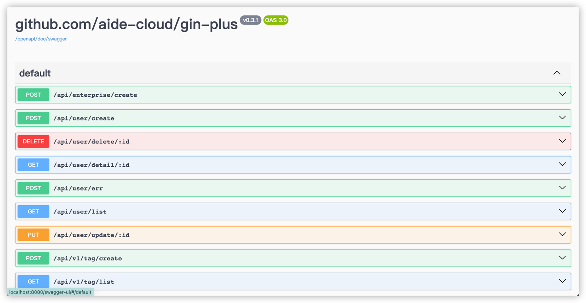
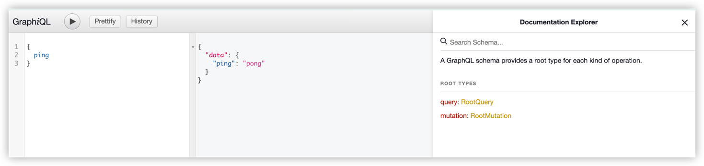
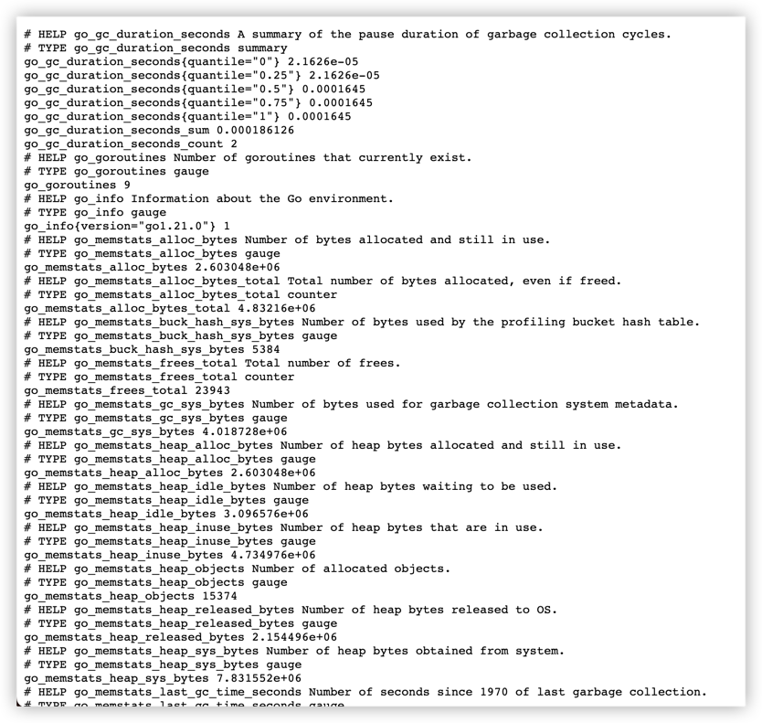

# gin-plus示例文档

## 项目介绍

gin-plus是基于gin封装的web框架，集成了swagger、route、graphql、prometheus-metrics、ping等常用功能，可以快速构建中小型RESTful
API项目。免于重复造轮子，专注于业务开发。虽然对gin进行了封装，但是尽量保持原生的风格，不会对gin的使用造成任何的影响。

## 项目特点

- 集成route，支持接口路由自动注册, 可以自动根据controller的方法名注册路由
- 集成swagger，支持接口文档自动生成
- 集成graphql，支持graphql接口
- 集成prometheus-metrics，支持接口性能监控, 开启metrics后，会自动在`/metrics`路径下生成接口性能监控数据, 可以被prometheus采集
- 集成ping，支持接口健康检查, 可以重写`/ping`路径下的接口健康检查逻辑
- 支持优雅退出，可以通过`Ctrl+C`触发优雅退出

## 初始化gin

```go
// 初始化gin
r := gin.Default()
```

> 以下下`r`都代表gin.Engine

## 初始化gin
```go
// 初始化gin
r := gin.Default()
```
> 以下下`r`都代表gin.Engine

## 原生姿势

```go
// 初始化gin-plus
ginEngine := ginplus.New(r)

ginEngine.GET("/say", func (c *gin.Context) {
c.JSON(200, gin.H{
"message": "hello world",
})
})
```

* 优点

> 1. 保持gin使用习惯, 无缝切换

* 缺点

> 1. 无法自动生成接口文档

## gin-plus姿势(原生增强版)

```go
type Article struct {}

func NewArticleAPI() *Article {
return &Article{}
}

func (a *Article) Post() gin.HandlerFunc {
return func (ctx *gin.Context) {
log.Println("create article")
}
}
// 初始化gin-plus
ginEngine := ginplus.New(r, ginplus.WithControllers(NewArticleAPI()))
```

* 优点

> 1. 使用习惯和gin相差不大
> 2. 增强了可以根据方法名称生成路由, 完成路由注册

* 缺点

> 1. 因为`gin.HandlerFunc`本身没有出入参数, 所以无法生成接口文档
> 2. 对不满足`gin.HandlerFunc`的方法无法注册路由

## gin-plus姿势(专注业务版)

```go
type Contract struct {}

func NewContract() *Contract {
return &Contract{}
}

type CreateReq struct {
Name string `json:"name" binding:"required"`
}

type CreateResp struct {
Id  string `json:"id"`
EID string `json:"eid"`
}

func (c *Contract) PostInfo(ctx context.Context, req *CreateReq) (*CreateResp, error) {
// TODO 业务逻辑
return &CreateResp{
Id:  "1",
EID: req.EID,
}, nil
}

// 初始化gin-plus
ginEngine := ginplus.New(r, ginplus.WithControllers(NewContract()))
```

* 优点

> 1. 使用习惯和gin相差不大, 跳过了`gin.HandlerFunc`这一层的封装
> 2. 增强了可以根据方法名称生成路由, 完成路由注册
> 3. 可以根据方法的参数和返回值自动生成接口文档
> 4. 可以专注于业务开发, 不用关心路由注册和接口文档维护

* 缺点

> 1. 必须按照规范定义方法, 才能自动生成接口文档和路由注册

## gin-plus姿势(专注业务版, 支持graphql)

```go
//go:embed sdl/*.graphql
var Sdl embed.FS

type Resolver struct {
}

func (r *Resolver) Ping() string {
return "pong"
}

func NewResolver() *Resolver {
return &Resolver{}
}

// 初始化gin-plus
ginEngine := ginplus.New(r,
ginplus.WithGraphqlConfig(ginplus.GraphqlConfig{
Enable:     true,
HandlePath: "graphql",
ViewPath:   "graphql",
Root:       graphql.NewResolver(),
Content:    graphql.Sdl,
}),
)
ginEngine.RegisterGraphql()
```

* sdl

```graphql
schema {
    query: RootQuery
    mutation: RootMutation
}

type RootQuery {
    ping: String!
}

type RootMutation {
    ping: String!
}
```

* 优点

> 1. 简化graphql的使用, 只需要定义sdl和resolver即可
> 2. 可以专注于业务开发, 不用关心路由注册和接口文档维护

## swagger

* http://localhost:8080/swagger-ui



```go
ginEngine := ginplus.New(r)
// 注册公共无权限路由
ginEngine.RegisterSwaggerUI()
```

## graphql

* http://localhost:8080/graphql



```go
ginEngine := ginplus.New(r)
// 注册公共无权限路由
ginEngine.RegisterGraphql()
```

## metrics

* http://localhost:8080/metrics



```go
ginEngine := ginplus.New(r)
// 注册公共无权限路由
ginEngine.RegisterMetrics()
```

## ping

* http://localhost:8080/ping

```go
ginEngine := ginplus.New(r)
// 注册公共无权限路由
ginEngine.RegisterPing()
```

## 链式调用注册路由

```go
ginEngine := ginplus.New(r)
// 注册公共无权限路由
ginEngine.RegisterSwaggerUI().RegisterPing().RegisterMetrics().RegisterGraphql()
```

## 原生中间件

```go
// 初始化gin
r := gin.Default()
// 注册中间件
r.Use(
middler.RecoverMiddleware(),
middler.LoggerMiddleware(),
middler.MetricSecondsMiddleware(),
middler.IpMetricMiddleware(),
middler.MetricRequestsMiddleware(),
)
```

## gin-plus中间件

### 模块级别

```go
func (v *V1) Middlewares() []gin.HandlerFunc {
return []gin.HandlerFunc{
func (ctx *gin.Context) {
log.Println("[v1] middleware 1")
},
}
}
```

### 方法级别

```go
func (u *User) MethoderMiddlewares() map[string][]gin.HandlerFunc {
return map[string][]gin.HandlerFunc{
"Update": {
func (ctx *gin.Context) {
log.Println("[User] Update mehtod middleware 1")
},
},
"List": {
func (ctx *gin.Context) {
log.Println("[User] List mehtod middleware 1")
},
},
}
}
```

## gin-plus路由(基于已有路由组注入)

```go
ginEngine := ginplus.New(r)
// 注册公共有权限路由
authGroup := r.Group("/auth", middler.MustLogin())
// 注册企业路由
enterpriseGroup := authGroup.Group("/enterprise/:eid")
ginEngine.GenRoute(enterpriseGroup.Group("/api/v2/enterprise/:eid"), contract.New())
```

### 获取父级路由参数

```go
type (
// DetailReq 定义请求参数
DetailReq struct {
EID string `uri:"eid" skip:"true"` // skip用于跳过本次注册, 但是不影响父级已有参数获取
ID  string `uri:"id"`              // 注册到当前路由里面
}

// DetailResp 定义返回参数
DetailResp struct {
Id   string `json:"id"`
EID  string `json:"eid"`
Name string `json:"name"`
}
)

// DetailInfo 定义更新方法
func (c *Contract) DetailInfo(ctx context.Context, req *DetailReq) (*DetailResp, error) {
// TODO 业务逻辑
return &DetailResp{
Id:   req.ID,
Name: "test",
EID:  req.EID,
}, nil
}
```

## 优雅关闭

```go
ginEngine := ginplus.New(r)
ginEngine.RegisterPing().RegisterMetrics()
// 启动gin-plus
ginplus.NewCtrlC(ginEngine).Start()
```